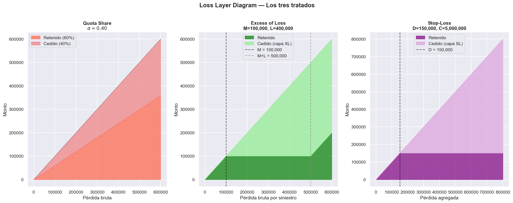
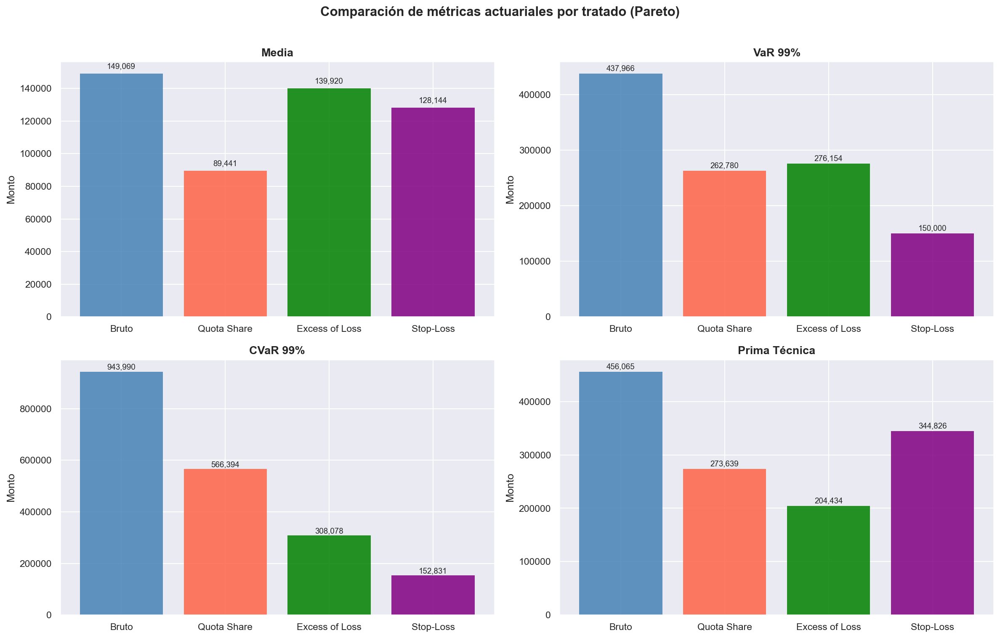
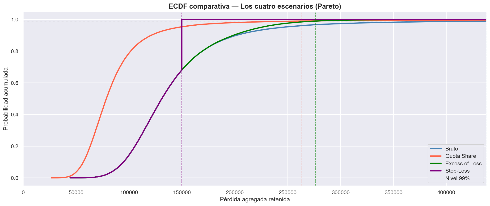

# Reinsurance Treaty Simulator

Simulador de tratados de reaseguro construido en Python para modelar cómo distintas estructuras de reaseguro reparten el riesgo entre una aseguradora y un reasegurador.

**Autor:** Mario Sánchez Flores — Estudiante de Actuaría  
**Stack:** Python 3.12 · NumPy · SciPy · Pandas · Matplotlib · Seaborn

---

## ¿Qué hace este proyecto?

Dado un portafolio de siniestros simulados con distribuciones de cola pesada (Pareto, Lognormal), aplica tres estructuras de reaseguro y compara su impacto en la pérdida neta retenida por la aseguradora usando métricas actuariales estándar.

### Modelo matemático

El portafolio se modela con el **Modelo Colectivo de Riesgo**:

$$S = \sum_{j=1}^{N} Y_j$$

donde $N \sim \text{Poisson}(\lambda = 50)$ y $Y_j$ sigue una distribución de cola pesada.

---

## Tratados de reaseguro analizados

| Tratado | Fórmula | Parámetros |
|---------|---------|-----------|
| Cuota Parte | $S^{\text{ret}} = (1-\alpha) \cdot S$ | $\alpha = 0.40$ |
| Excess of Loss | $Y_j^{\text{ret}} = \min(Y_j, M)$ | $M = 100,000$, $L = 400,000$ |
| Stop-Loss | $S^{\text{ret}} = S - \min((S-D)_+, C)$ | $D = 150,000$, $C = 5,000,000$ |

---

## Resultados principales

### Pareto (α=1.5, xm=1,000)

| Tratado | Media | VaR 99% | CVaR 99% | Prima Técnica |
|---------|-------|---------|----------|---------------|
| Bruto | 149,069 | 437,966 | 943,990 | 456,065 |
| Quota Share | 89,441 | 262,780 | 566,394 | 273,639 |
| Excess of Loss | 139,920 | 276,154 | 308,078 | 204,434 |
| Stop-Loss | 128,144 | 150,000 | 152,831 | 344,826 |

### Lognormal (μ=8, σ=1.5)

| Tratado | Media | VaR 99% | CVaR 99% | Prima Técnica |
|---------|-------|---------|----------|---------------|
| Bruto | 458,928 | 1,133,552 | 1,480,001 | 758,911 |
| Quota Share | 275,357 | 680,131 | 888,001 | 455,347 |
| Excess of Loss | 415,222 | 748,462 | 806,007 | 599,118 |
| Stop-Loss | 156,502 | 150,000 | 150,041 | 169,497 |

---

## Conclusión principal

> La efectividad del reaseguro depende de la distribución de pérdidas. Un XL con M=100,000 es óptimo para Pareto pero ineficiente para Lognormal. El Stop-Loss es el tratado más robusto en ambas distribuciones.

---

## Estructura del proyecto

| Carpeta | Contenido |
|---------|-----------|
| `notebooks/` | 6 notebooks: simulación, 3 tratados, métricas y reporte final |
| `src/` | `simulation.py` y `treaties.py` |
| `data/` | Siniestros simulados en CSV |
| `figures/` | 11 visualizaciones exportadas |
| `requirements.txt` | Dependencias del proyecto |

## Instalación y uso

git clone https://github.com/msfclon/Reinsurance-Treaty-Simulator.git
cd Reinsurance-Treaty-Simulator
pip install -r requirements.txt
jupyter notebook notebooks/06_main_report.ipynb

---

## Visualizaciones

### Loss Layer Diagram

### Comparación de métricas

### ECDF comparativa

## Limitaciones y trabajo futuro

- Se modela una sola capa XL; en la práctica se usan múltiples capas consecutivas
- Los parámetros de los tratados ($M$, $D$, $C$) no fueron optimizados; una extensión natural es encontrar el $M$ óptimo para cada distribución minimizando la prima técnica
- No se modeló el costo explícito del reaseguro (prima cedida al reasegurador)
- Los siniestros individuales no se guardan en disco; el módulo XL requiere resimulación en cada ejecución
- Extensión futura: incorporar múltiples líneas de negocio y correlación entre portafolios